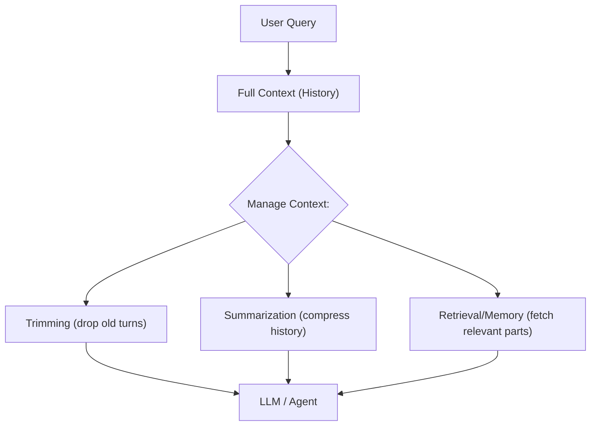

# Context Trimming and Summarization in AI Agents

## Executive Summary  
Large language models (LLMs) degrade in performance as conversation length grows, making **context management** essential. Strategies fall into categories like simple **truncation** (keep last-N turns), **rule-based filters**, **retrieval/pruning algorithms**, **neural summarization**, and **hybrid memory** methods. Truncation (no extra compute) is fast but can “forget” early context, while LLM-based summarization retains long-range facts at the cost of added latency. Hybrid approaches (e.g. segment-level memory with denoising) balance these trade-offs. Recent work (2023–2026) introduces methods like MemoryBank, MemoChat, SeCom, ACON, and DyCP. This report defines key problems, reviews methods with summaries of core techniques and trade-offs, surveys benchmarks/metrics (e.g. GPT4Score, EM, recall), and provides practical pseudocode and guidance (particularly for non-LLM heuristics). Tables compare methods on accuracy impact, cost, and latency. We also highlight open challenges (e.g. lossless compression, evaluation standards) and future directions.

## Problem Definition  
Agents accumulate long conversation histories (user messages, responses, tool outputs). Unbounded context strains LLMs: quadratic cost in attention, higher latency, and performance drop as irrelevant history “distracts” the model. **Context trimming/summarization** seeks to reduce this input while keeping relevant information. Formally, given full history $H=\{u_1,r_1,\dots,u_T\}$ and query $q$, generate a reduced context $C(H,q)$ (via pruning or summary) such that the LLM’s performance on tasks (QA, dialogue) remains high. Key goals include preserving important facts/constraints, minimizing compute/token usage, and maintaining coherence. Approaches vary in whether they treat context as text to **truncate or compress** or as “memories” to be **retrieved or updated**. Efficiency measures (cost, latency) and accuracy trade-offs must both be considered. 

## Taxonomy of Methods  
Context management strategies can be categorized as follows:  
- **Truncation/Rule-based Heuristics:** Drop oldest or lowest-priority utterances (e.g. fixed last-N turns, keyword filters). Simple and zero-overhead but may lose vital early info.  
- **Symbolic/Structured:** Extract and store key facts (entities, knowledge triples) via NLP pipelines or knowledge graphs. Allows targeted recall but requires domain-specific rules or ontologies.  
- **Retrieval/Pruning Algorithms:** Use similarity or heuristics (e.g. TF-IDF, embeddings) to select relevant context spans. Examples include segment selection by Kadane’s algorithm (DyCP) or topic-based splitting (RMM). These algorithmic methods can preserve coherence with moderate cost.  
- **Neural Summarization:** Apply LLMs or seq2seq models to **compress** history into concise summaries. Methods range from one-shot prompts to recursive summarization (e.g. Wang et al.’s LLM-Rsum) or fine-tuned pipelines (MemoChat). They retain long-range info but add latency and potential “summary drift.”  
- **Hybrid Memory Systems:** Combine summarization and retrieval. For example, SeCom segments dialogue topically and then compresses each segment, using dense retrievers for recall. MemoryBank maintains episodic memories with update/forget mechanisms. RMM (Reflective Memory Management) creates topic-level memory entries and uses LLM feedback to retrain retrieval.  
- **Compression Techniques:** Use specialized compressors to encode context into embeddings or shorter prompts. “Implicit” methods encode long text into dense vectors (Pretrained Context Compressor), whereas “explicit” methods drop tokens by importance. ACON optimizes prompt-based compression via LLM-in-the-loop feedback and distillation.  

This taxonomy is not mutually exclusive; many systems mix elements (e.g. neural summarizer + symbolic retrieval). The table below summarizes example methods and their features.

| Method (Citation)      | Type              | Core Technique                                            | Complexity         | Key Assumptions                        | Limitations                        |
|-----------------------|-------------------|-----------------------------------------------------------|--------------------|----------------------------------------|------------------------------------|
| **Truncation (Last-N)**  | Rule/Heuristic   | Drop all but most recent turns                            | $O(1)$ per turn    | Recent context is sufficient            | Loses long-term info abruptly |
| **Keyword/Topic Heuristics** | Rule-based      | Retain utterances with certain keywords or tags           | $O(n)$ scan       | Keywords capture importance             | May miss implicit context           |
| **DyCP** (Choi et al., 2026)   | Algorithmic/Hybrid| Score each turn (e.g. embeddings) and apply extended Kadane to pick contiguous relevant span | $O(n)$ per query   | Relevance scores align with needed context | Needs good retriever; threshold tuning |
| **RMM** (Tan et al., 2025)      | Hybrid/Memory   | Decompose history into topic segments (LLM-based), RL-trained reranker for retrieval  | High (training)    | Dialogue topics can be segmented        | Complex; relies on RL signals        |
| **Recursively Summ. (LLM-Rsum)** (Wang et al., 2023) | Neural Summarization| LLM generates incremental “memory” summary of past dialogs  | High (LLM calls)   | LLM can summarize reliably              | Latency; summary errors may accumulate |
| **MemoChat** (Lu et al., 2023) | Neural Summarization| Instruction-finetuned LLM to create/retrieve structured memos  | High (finetuning)  | Requires large dialogue data           | Expensive tuning; API-dependent      |
| **MemoryBank** (Zhong et al., 2023) | Memory/Hybrid   | Store dialogue turns + daily summaries; dense retrieval with Ebbinghaus forgetting decay | $O(n)$ retrieval, memory indexing | Memory entries represent events            | Overhead of storage/index; hyperparams for decay |
| **SeCom** (Pan et al., 2025)    | Retrieval/Hybrid| Segment long chat into topically coherent chunks, compress each via prompt, retrieve segments (no summarization) | Moderate (segmentation + retrieval) | Topical segmentation yields cohesive units | Segmentation errors; extra processing step |
| **ACON** (Kang et al., 2025)    | Neural Compression | LLM-in-the-loop to optimize compression prompts, then distill compressors | High (LLM analysis, distillation) | LLM can learn from success/failure examples | Complex pipeline; domain-specific data |
| **Pretraining Compressor** (Dai et al., 2025) | Neural Compression | Pretrained encoder compresses context into fixed-size embeddings for LLM | Training cost; inference fast | LLM decoding can reconstruct compressed context | Potential information loss at high compression |

## Rule-Based and Heuristic Methods  
A simple baseline is **fixed-window truncation**: keep only the last *N* turns or up to a token limit. For example:  

```python
def trim_context(history, max_tokens):
    # history: list of (user, assistant) turns
    while count_tokens(history) > max_tokens:
        history.pop(0)  # drop oldest turn
    return history
```

Trimming is *deterministic* and incurs **no extra compute**, but it abruptly forgets older context. As noted by OpenAI, truncation “forgets long-range context abruptly” and can drop constraints or facts made earlier. Its advantages are predictability and zero latency cost. 

Heuristic filters might drop messages based on rules (e.g. remove system/tool outputs, drop messages with low information density). For instance, one could keep only utterances containing specific keywords or named entities. Rule-based systems might also track “pinned” facts (e.g. user name, long-lived preferences) to always retain. Such methods require hand-crafted rules or metadata but need no LLM calls. Their trade-offs include missing implicit context and difficulty capturing nuance.

### Practical Guidance – Pseudocode and Trade-offs  
- **Fixed Sliding Window:** As above, simply pop oldest entries beyond the window. *Pros:* simplest, zero added latency. *Cons:* can “lose” important earlier details, leading to context “amnesia”. Use when interactions are independent or only recent context matters.  
- **Heuristic Pruning:** Tag or score turns (e.g. number of named entities or semantic novelty) and remove lowest-score ones if over budget. This adds minimal cost (just scoring), but risks dropping context the LLM might still need.  
- **Selective Retention:** Rules like “always keep system instructions or last user query” ensure critical info persists. The code might:  
  ```python
  protected = extract_core_facts(history)
  allowed_drop = [turn for turn in history if turn not in protected]
  while token_count(history) > limit and allowed_drop:
      history.remove(allowed_drop.pop(0))
  ```  
  *Pros:* prevents forgetting key facts. *Cons:* requires specifying what’s “core”, and static rules may not generalize.  

These rule-based methods are easy to implement (algorithmic complexity ~$O(n)$ for simple scans) and fully transparent. In practice, one often combines truncation with prioritizing certain tokens (e.g. always keep the last assistant answer or user instruction) to balance fidelity and brevity. 

## Retrieval-Based and Pruning Algorithms  
Beyond static rules, many methods algorithmically **select relevant context**. A common approach is to encode each past turn and the query into embeddings, then retrieve the top-$k$ relevant turns. For example, one can use a dense retriever (like a bi-encoder) to score turns, then concatenate the highest-scoring ones into the prompt. 

A notable technique is **dynamic segment selection**. For instance, *DyCP* first computes relevance scores for each past utterance, then uses a modified Kadane’s algorithm to pick contiguous spans of dialogue with maximal total relevance (KadaneDial in Algorithm 1). This preserves discourse continuity (one long run of utterances rather than disjoint snippets). The algorithm runs in linear time per query relative to history length, plus the cost of scoring (e.g. bi-encoder retrieval is $O(n)$ with an efficient library). In DyCP’s experiments, using these top segments significantly improved answer quality while cutting latency. Its limitations include reliance on a good retriever model and tuning the span length threshold.

**Topic/Session Pruning:** Some works split the conversation into self-contained sessions or topics and drop entire chunks. For example, Reflective Memory Management (RMM) uses an LLM-based model to segment history into topical groups and stores each as a memory entry with a short summary. At query time, only the relevant topics are recalled. This reduces tokens but requires a segmentation model and retraining of a reranker.  

**Token Pruning:** At a lower level, methods like *Saliency-Driven Token Pruning* prune tokens inside the LLM’s input using learned saliency scores (though this is more model-level than agent context). These techniques reduce computation in the feed-forward pass but still require the token in cache, so we focus instead on turn-level pruning. 

**Retrieval Accuracy Metrics:** Systems are often evaluated on whether important tokens are dropped. DyCP, for example, reports *Recall@k*, *Precision@k*, and *Hit@k* of relevant evidence given known answer keys. In practice, developers measure the LLM output quality (e.g. GPT-4Score) and monitor how many necessary facts were omitted by pruning.

## Neural Summarization Methods  
Neural summarization leverages LLMs to **compress history into a compact text**. One straightforward approach is to periodically prompt an LLM (or smaller summarization model) to summarize the oldest portion of the chat. This summary then replaces those turns in context. For example, a system might every 10 turns call: “*Summarize the key information from the previous conversation*” and store the result as a summary turn.

In *Recursively Summarizing* (Wang et al., 2023), the authors use the LLM to iteratively build a long-term “memory”. Initially the LLM is asked to summarize a short dialogue snippet. Then as new dialogue comes in, the LLM is prompted: “*Given prior memory [old summary] and this new context, produce an updated memory*.” This continues recursively, so the memory summary is continuously refreshed. At answer time, the LLM responds conditioned on the latest memory instead of raw history. This method preserved consistency over multi-session chats in their experiments. The cost is that each summary update is a full LLM call, and errors or omissions can accumulate (summary drift). They evaluate on conversation datasets (e.g. “CareCall” and “Multi-Session Chat”) using BLEU/F1/BERTScore for answer quality.

Another example is *MemoChat* (Lu et al., 2023), which trains or prompts an LLM to generate “memos” (structured summaries) and retrieve them in future turns. They frame the dialogue as a loop of “memorization–retrieval–response,” using instruction tuning to teach an open-source LLM to write and use memos. MemoChat showed improved factual consistency over long open-domain chats. Like other LLM-based memos, it requires costly finetuning or repeated prompting, and its quality depends on the chosen instruction dataset. The advantage is that rich semantic information can be captured (beyond what simple heuristics pick up), but at the expense of inference latency and possible hallucination if the LLM mis-summarizes.

### Practical Guidance – Summarization Pseudocode  
A simple summarization schedule might be:
```python
if turns_since_last_summary >= K:
    summary = LLM.summarize(old_summary + recent_turns)
    replace old_summary with summary
```
This rolling scheme **retains long-range info** compactly. However, be aware of “compression drift”: details lost early can never reappear, and errors can propagate. Including a few recent verbatim turns alongside summaries can mitigate forgetting of the very latest details. 

## Hybrid and Memory-Based Approaches  
Hybrid systems combine summarization and retrieval. For instance, *CondMem* (Yuan et al., 2025) – not directly cited here – reportedly merges summarization with selective memory storing. More concretely, **SeCom** (Pan et al., 2025) partitions conversation into topically coherent *segments* (via a learned segmentation model) and treats each segment as a memory unit. Rather than summarizing text, they apply a prompt-based “compression” (denoising) to each segment to improve retrievability. In experiments, segment-level memory gave better retrieval accuracy and response quality on long-dialogue benchmarks (LoCoMo, Long-MT-Bench+) than turn-level or naively summarized memory. SeCom’s pipeline: segment→compress→index and retrieve. This avoids summary drift (no information loss from summarization), but assumes that segmentation works well and adds a segmentation model overhead.

**MemoryBank** (Zhong et al., 2023) implements a hierarchical memory store. It records raw dialogue (with timestamps), daily event summaries, and a user “personality profile.” An LLM (or transformer embedder) turns each utterance or summary into vectors indexed by FAISS. At query time, relevant memories are retrieved (e.g. the chatbot’s name or past preferences) to augment the prompt. MemoryBank also applies an *Ebbinghaus forgetting* model: memory items have a “strength” that decays over time and is boosted on recall. This mimics human memory, preventing the store from growing without bound. While MemoryBank is neural (uses LLMs for summaries and personality extraction), it’s hybrid in that it maintains an explicit external memory. It greatly enhances personal assistant bots (e.g. “SiliconFriend”) but requires implementing and tuning the memory update rules, and incurs storage and retrieval overhead. Zhong et al. report qualitative improvements in long-term dialogue recall.

Reflective Memory Management (RMM, Tan et al., 2025) also builds structured memory entries. It **prospectively** breaks dialogues into topic-summary pairs (each memory entry is a topic summary + raw snippet) and **retrospectively** refines the retriever with LLM-based feedback (RL to rerank memories). RMM is complex but addresses granularity (by not using fixed session vs turn units) and uses LLM judgments to improve retrieval. Such systems are cutting-edge and not fully open-sourced, but they point toward adaptive, data-driven memory management.

Finally, compression-based hybrid methods include **ACON** (Kang et al., 2025). ACON frames context compression as an optimization problem: it uses an LLM to compare full vs compressed contexts of successful/failing agent trajectories and to refine compression guidelines in natural language. Essentially, it “teaches” itself how to compress history via LLM analysis, then distills that compression model into a small agent. On benchmarks (AppWorld, OfficeBench, multi-objective QA), ACON reduced peak context tokens by 26–54% while retaining ≈95% task accuracy. This is a meta-learning approach to compression. It’s promising for tasks beyond pure dialogue (including tool use), but involves an elaborate training phase and may require domain-specific data.

## Evaluation Metrics and Benchmarks  
Context management methods are evaluated on both *effectiveness* and *efficiency*:

- **Answer Quality / Task Success:** Often measured by GPT-4Score (LLM-as-judge scoring 1–100) or traditional metrics. For factual QA tasks (like LoCoMo), Exact Match (EM) and ROUGE/L scores are common. For dialogue consistency, BLEU, F1, or human judgments are used (e.g. Recursively Summarizing reported BLEU and human eval).  
- **Retrieval Metrics:** If applicable, retrieval accuracy (Recall@k, Precision@k, NDCG) of relevant past facts is reported. A high recall means the pruned context still contains needed evidence.  
- **Latency and Cost:** First-token or end-to-end latency is measured (DyCP tracks latency reduction). Token reduction (context length) and LLM API usage are also considered. Some papers report “input+output tokens” and price (Table 2 in DyCP).  
- **Memory Overhead:** For memory systems, storage growth and query time are benchmarks. (MemoryBank qualitatively evaluates recall and coherence).  
- **Benchmarks:**  
  - **LoCoMo** (Maharana et al., 2024) – multi-turn open-domain dialogue with questions on dialogue content.  
  - **MT-Bench+ / Long-MT-Bench+** – benchmark of dialogue tasks spanning 100+ turns.  
  - **Multi-Session Chat** (Xu et al., 2022) – multi-topic chat dataset.  
  - **AppWorld/OfficeBench** (Trivedi et al., 2024; Wang et al., 2024) – long-horizon planning tasks.  
  - **Simulated Personal Chats** (MemoryBank’s “SiliconFriend”) – custom evaluation with probing questions.  

In summary, evaluations measure how well trimmed or summarized context preserves answer accuracy while reducing compute. For example, DyCP reports that pruning cuts response latency by ~70% with negligible drop in GPT-4 judged quality. SeCom reports higher retrieval DCG and answer quality than turn-level methods for equal context budgets. ACON reports >95% accuracy retained with ~50% fewer tokens. 

## Implementation and Reproducibility  
Many recent methods provide code and use public datasets:

- **DyCP:** (Choi et al., 2026) – code and paper on arXiv; uses Contriever/BGE for retrieval embeddings. Benchmarks: LoCoMo, SCM4LLMs, MT-Bench+.  
- **MemoChat:** Code released (GitHub: LuJunru/MemoChat). Fine-tunes LLaMA-like models. Evaluation: newly annotated consistency test sets.  
- **MemoryBank:** Code released (GitHub: zhongwanjun/MemoryBank-SiliconFriend). Uses Faiss for indexing. Dataset: custom simulated dialogues (15 users, 10-day logs).  
- **SeCom:** ArXiv + code (GitHub: zhubozsecom). Uses proprietary segmentation model and LLMLingua-2 compression. Benchmarks: LoCoMo, Long-MT-Bench+.  
- **ACON:** ArXiv. Code may be released (authors from Microsoft). Uses task suites (AppWorld, OfficeBench) for training LLM compression.  
- **Pretraining Compressor:** (Dai et al., 2025) – ACL; may have code (affiliated with Microsoft/Azure). Experiments on 8 datasets (RAG, summarization, etc).  
- **Baselines/Datasets:** Many works reuse retrieval benchmarks (MSMARCO for retriever, LoCoMo’s QA, Multi-Session Chat, etc). The *LoCoMo* dataset has passage annotations for retrieval evaluation.  
- **Tools:** Common frameworks like HuggingFace Transformers, Faiss, and RL libraries. Reproducibility often relies on fixed random seeds. 

In practice, selecting a method depends on resources: rule-based pruning requires no extra code or hardware; retrieval needs a vector database; neural summarization needs access to a capable LLM or a summarization model. Many authors release their code repositories (see references above).

## Practical Advice for Rule-Based Systems  
If using only algorithmic or symbolic methods (no LLM API calls), one can implement:

1. **Token Budget Manager:** Track total tokens in context. When exceeding a threshold, apply trimming or summarization.  
2. **Heuristic Dropping:** Predefine rules: e.g. always keep system prompts or tool outputs; drop mundane chit-chat. Use metadata tags or regex.  
3. **Topic Change Detection:** If possible, detect when the conversation topic shifts (e.g. via keywords or a small topic classifier) and compartmentalize. For example, conclude the previous topic and drop its details.  
4. **Static Summaries:** Precompute extractive summaries via algorithms like TextRank on earlier turns, then replace them. (This avoids LLM calls but may still need a summarization model or heuristic.)  
5. **Pseudocode Example – Keyword Prioritization:**  
   ```python
   keywords = set(extract_keywords(goal + current_query))
   important_turns = [turn for turn in history if any(k in turn for k in keywords)]
   # Keep all important turns, plus last few turns
   new_context = important_turns + history[-M:]
   ```
   This ensures preserving turns containing task-relevant terms.  

**Trade-offs:** These heuristics are fast but brittle. They require manual tuning of rules and may not generalize across tasks. Symbolic memory (e.g. storing a knowledge base of facts) can complement trimming: e.g., extract (entity, value) pairs and maintain a lookup. However, designing such a system is domain-specific. For general usage, a simple strategy is often: *keep the last N turns*, possibly appended with a summary of everything before (computed when idle). This yields consistent behavior and is easy to analyze. 

## Open Problems and Directions  
Despite progress, many challenges remain:  
- **Lossless Compression:** How to reduce context without any performance drop? Most methods incur *some* information loss. Techniques like model internal compression (ACON, token pruning) are promising but underexplored in dialogue.  
- **Adaptive Strategies:** Current methods use fixed rules (e.g. prune per query). Learning *when* to compress vs. append context (e.g. via RL or uncertainty triggers) is open.  
- **Better Metrics:** Relying on GPT4Score or ROUGE may not capture downstream task utility. Benchmarks for memory utility in conversations are limited. The field needs agreed-upon benchmarks specifically for context trimming (beyond QA accuracy).  
- **Structured Memory Integration:** Combining symbolic knowledge graphs with LLM memories could allow removing raw text while retaining facts. How to update such graphs reliably is unsolved.  
- **Multimodal and Tool Outputs:** Agents may have non-text context (images, code, tool logs). Efficient summarization of multi-modal state remains a frontier.  
- **Scalability:** As LLM context windows grow (up to millions of tokens), when do we still need trimming? Even with very long context windows, irrelevant growth will degrade performance, so trimming methods must scale with context length.  

Future directions include hybrid LLM/non-LLM pipelines (e.g. using small neural summarizers, retrieval systems, or learned compressors), and end-to-end training of context selectors with task objectives. 

## Comparison of Methods  

| Method        | Accuracy Impact | Compute/Memory Cost  | Latency | Typical Use Case              |
|---------------|-----------------|----------------------|---------|-------------------------------|
| *Last-N Trimming*| High loss if old facts needed | None extra | None (fast) | Short-term chat, command execution |
| *Heuristic Filters*          | Medium (depends on rule quality) | Low (simple checks) | None | Specific tasks with known key facts |
| *DyCP (Kadane)*| Low loss (keeps relevant span) | Medium (embed + scan) | Low | Long dialogues with topical goals |
| *SeCom (segment+denoise)*| Preserves accuracy (better than baseline) | High (segmentation model + compression) | Medium | Multi-topic, open-domain chat |
| *Recursively Summ.*| Low loss (memory-aware) | High (LLM calls per update) | High | Very long multi-session conversation |
| *MemoChat*       | High consistency gain        | High (finetuning + inference) | High | Open-domain chatbots requiring consistency |
| *MemoryBank*  | High (empathy/personalization) | Medium/High (storage + retrieval) | Medium | Personal assistants, counseling |
| *RMM (topic+RL)* | High (adaptive retrieval)     | Very High (training, RL) | High (online retraining) | Personalized multi-session agents |
| *Pretrained Compressor* | Small drop (≈4x–16x) | Medium (compressor model) | Low per query | Any long-input tasks (RAG, summarization) |
| *ACON (LLM-opt)*| <5% drop with ~50% fewer tokens | Very High (LLM training loop) | Variable (compressor distillation) | Agent tasks with extended horizons |

Table columns are qualitative: “Accuracy Impact” indicates relative drop or improvement (lower is better loss). “Compute” includes offline and online costs, “Latency” is response delay.  

Each method trades off context fidelity vs efficiency differently. Rule-based methods (first row) minimize compute but can incur large accuracy loss if important info is trimmed. Summarization/memory methods (e.g. Recursively Summ., MemoryBank) retain more information at the expense of extra LLM calls or storage. Retrieval-based methods (DyCP, SeCom) offer moderate cost and strong accuracy preservation. Compression techniques (Pretrained Compressor, ACON) suggest that custom models can tightly compress context with minimal loss.



*Diagram:* Simplified pipeline of context management options. One may drop old turns (no LLM), compress history into a short summary (LLM call), or retrieve key pieces from memory. All feed the trimmed context to the agent’s LLM to produce a response.

**Sources:** Method descriptions and evaluations are drawn from recent literature. Each bracketed reference corresponds to a published or preprint source used above.

